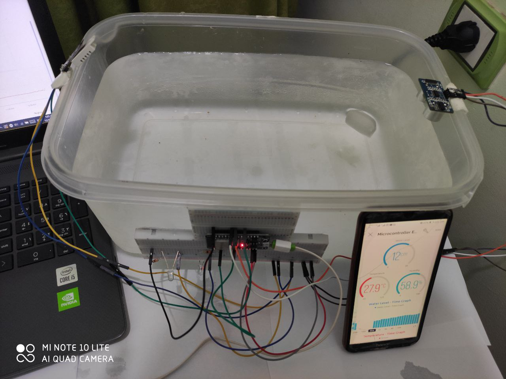
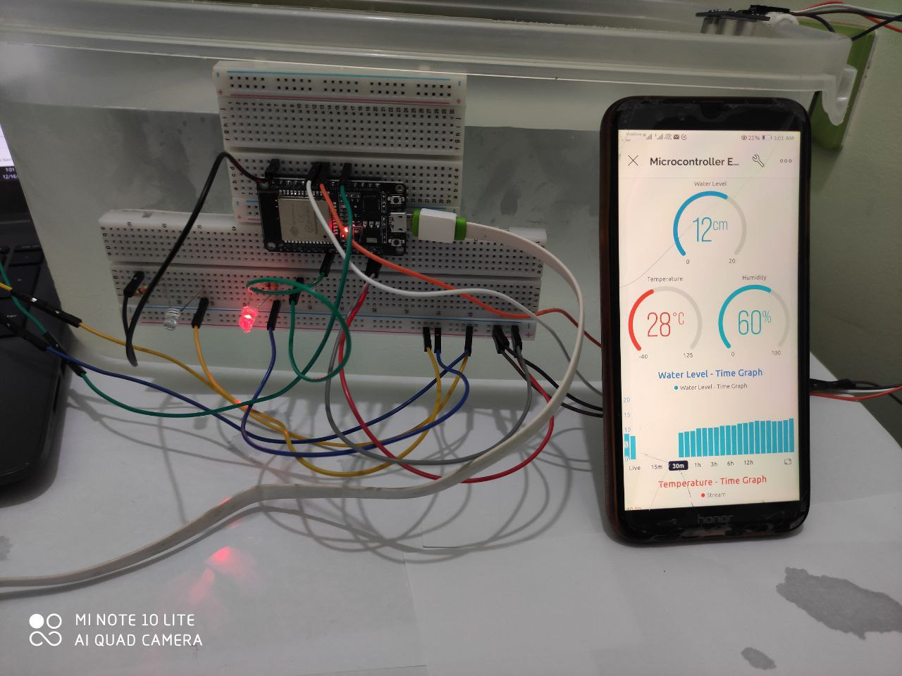

# 💧 Water Level IoT Monitoring System

## 📘 Overview
This project is a real-time IoT system designed to **monitor water levels and environmental conditions** using an **ESP32 microcontroller**.  
It employs an **ultrasonic sensor** to measure water height and a **DHT22 sensor** to detect temperature and humidity.  
All data is sent to the **Blynk Cloud** for remote visualization and monitoring via a mobile app.

LED indicators provide **on-site danger alerts** based on the current water level:

- 🔴 **Red LED:** Critical low water level  
- 🟡 **Yellow LED:** Warning — approaching low threshold  
- 🟢 **Safe range:** When both LEDs are off  

---

## ⚙️ Technologies Used
- **ESP32 Microcontroller**
- **Ultrasonic Sensor (HC-SR04)**
- **DHT22 Temperature & Humidity Sensor**
- **Blynk IoT Cloud Platform**
- **C++ (Arduino IDE)**
- **Wi-Fi Connectivity**

---
## Prototype 



---

## 🚀 Features
- Automated **data collection and cloud reporting** via Blynk.  
- **Wi-Fi-enabled real-time monitoring** accessible from any device.  
- **Modular C++ code structure** for easy modification and scalability.  
- **LED-based alert system** for proactive water level management.  

---

## 📊 System Workflow
1. The **ultrasonic sensor** measures the distance to the water surface.  
2. The **DHT22 sensor** reads temperature and humidity.  
3. The **ESP32** processes sensor data and transmits it to the **Blynk Cloud**.  
4. The **mobile dashboard** displays the readings in real time.  
5. LEDs indicate the **danger level** based on predefined height thresholds.  

---

## 📱 Cloud Dashboard (Blynk)
| Virtual Pin | Sensor/Output       | Description               |
|--------------|--------------------|---------------------------|
| V0           | Water Level (cm)   | Real-time water height    |
| V1           | Temperature (°C)   | Ambient temperature       |
| V2           | Humidity (%)       | Relative humidity         |

---

## 🔧 Setup Instructions
1. Connect the **DHT22** and **Ultrasonic Sensor** to the **ESP32** as per the pin definitions in the code.  
2. Install the required Arduino libraries:
   - `Blynk`
   - `DHT sensor library`
   - `Adafruit Unified Sensor`
3. Replace the following in your code:
   ```cpp
   char ssid[] = "YOUR_WIFI_NAME";
   char pass[] = "YOUR_WIFI_PASSWORD";
   char auth[] = "YOUR_BLYNK_AUTH_TOKEN";
4. Upload the code to your ESP32.
5. Open the Blynk mobile app to monitor the readings in real time.

---

## 🌍 Impact
This system helps reduce the negative effects of water scarcity by providing early warnings for low water levels.
It enhances resource efficiency and remote supervision, offering a scalable solution for IoT-based environmental monitoring.
